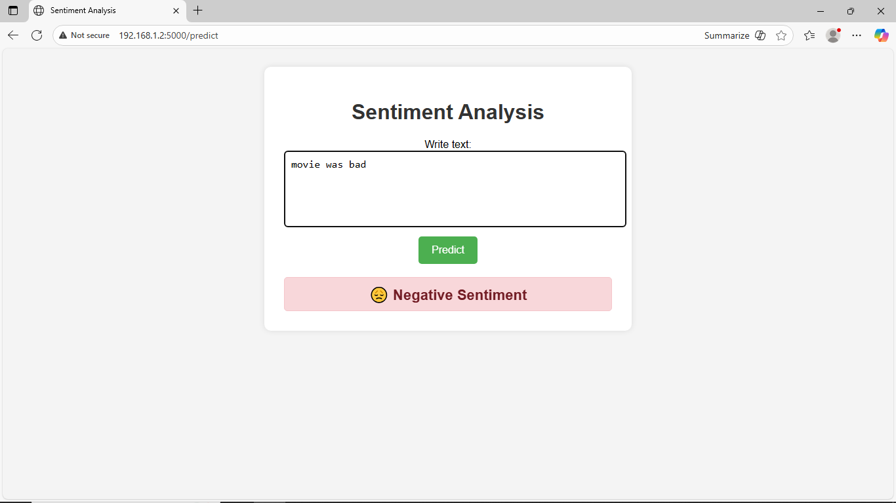
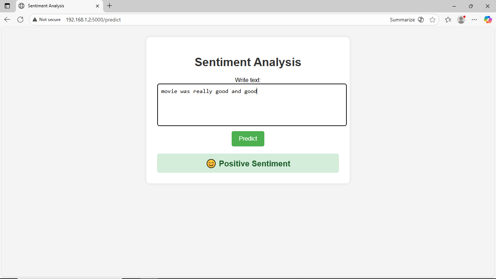

# Movie-Review-NLP-Pipeline
end to end NLP Pipeline of Movie review including DVC and MLOPS and Dagshub
## Project Overview
 aims to process and analyze movie reviews using Natural Language Processing (NLP) techniques. To enhance its functionality and usability, consider the following improvements:

## Project Overview

This project aims to build a robust pipeline for sentiment analysis on movie reviews. It covers the entire workflow, including data preprocessing, training machine learning models, evaluating their performance, and visualizing the results.

---

## Features

- Data preprocessing: tokenization, lemmatization, stopword removal  
- Feature extraction using TF-IDF vectorization  
- Sentiment classification with models like Logistic Regression, SVM, and Random Forest  
- Model evaluation using accuracy, precision, recall, and F1-score  
- Visualization of sentiment distribution and word clouds  
- Optional deployment as a web application using Flask or Streamlit  
- Integrated with DVC for data and model versioning  
- MLOps capabilities and Dagshub support  

---
## Create and activate a conda environment (recommended Python version 3.10):
```bash
conda create -n nlp-movie-review python=3.10 -y
conda activate nlp-movie-review
```
---

## Installation

1. Clone the repository:

```bash
git clone https://github.com/chandrasai-Durgapu/Movie-Review-NLP-Pipeline.git
cd Movie-Review-NLP-Pipeline
```

---
## Install dependencies:
```bash
pip install --upgrade pip setuptools wheel
pip install -r requirements.txt
```
---
---
## Using DVC

Initialize and configure DVC remote storage:
```bash
dvc init
mkdir local_s3    # temporary local remote storage
dvc remote add -d mylocal local_s3
dvc repro
```
## Add files to git & DVC:
```bash
git add data/.gitignore models/.gitignore dvc.lock reports/.gitignore
dvc commit
dvc push
```

## Check configured remotes:
```bash
dvc remote list
```

## Enable auto-staging:
```bash
dvc config core.autostage true
```
```bash
dvc push
```
---
## Running the Flask App

Start the Flask application:
```bash
python flask_app/app.py
```
---
## Run flask app added

python flask_app/app.py

http://127.0.0.1:5000


---
## 🌐 MLflow Experiment Tracking with DAGsHub

This project uses **MLflow** to log model experiments and metrics, and integrates with **DAGsHub** for remote tracking and versioning.

### 🔗 MLflow Tracking URI (via DAGsHub)

**Tracking Server:**  
[https://dagshub.com/chandrasekharcse522/Movie-Review-NLP-Pipeline.mlflow](https://dagshub.com/chandrasekharcse522/Movie-Review-NLP-Pipeline.mlflow)

**DAGsHub Repo:**  
[https://dagshub.com/chandrasekharcse522/Movie-Review-NLP-Pipeline](https://dagshub.com/chandrasekharcse522/Movie-Review-NLP-Pipeline)

---
## Visuals / Examples

| Type     | Example |
|----------|---------|
| Negative Review Example  |  |
| Positive Review Example |  |


## Troubleshooting / Development Notes

Python 3.13 Compatibility:
Python 3.13 is currently unstable for this project’s dependencies. Many errors occur when installing necessary packages. It’s recommended to use Python 3.10 for stable support.

Requirement fixes:

Replace antlr4-python3-runtime==4.9.3 with antlr4-python3-runtime>=4.11.0 in requirements.txt

Remove fusepy==3.0.1 from requirements.txt (required during cloud deployment CI/CD to aws cloud)

Update matplotlib from 3.9.1 to 3.9.4 or leave version unspecified for latest compatible release

For hydra-core, either remove the version pin or update to hydra-core>=2.0.0

Common package installs to fix matplotlib dependencies:
```bash
pip install numpy
pip install matplotlib
```
Clear pip cache if you face installation issues:
```bash
pip cache purge
```
Use pip install --only-binary :all: -r requirements.txt if you want to install only pre-built binaries.
## Common pip/conda Commands to Resolve Package Issues
```bash
conda clean --all -y  

conda create -n nlp-movie-review python=3.10 -y

conda activate nlp-movie-review

pip install -r requirements.txt

pip install -r requirements.txt --verbose


pip install build

pip install --upgrade pip setuptools wheel
pip install numpy  # matplotlib depends on this
pip install matplotlib


pip cache purge

pip install -r requirements.txt

conda install matplotlib

python -m pip install --upgrade pip setuptools wheel
python -m pip install numpy  # matplotlib dependency
python -m pip install matplotlib

conda install numpy matplotlib -y

python -m pip install --upgrade pip setuptools wheel


pip install C:\path\to\downloaded_file.whl


pip install C:\Users\Chandra\Downloads\matplotlib-3.9.1-cp310-cp310-win_amd64.whl
```
<!-- cd C:\Users\Chandra\Downloads

pip install matplotlib-3.9.1-cp310-cp310-win_amd64.whl -->
```bash
pip install --only-binary :all: -r requirements.txt
```
---
requirements.txt file has....>>>>   antlr4-python3-runtime==4.9.3

replace it--->>>    antlr4-python3-runtime>=4.11.0

2) fusepy==3.0.1 (delete it)

```bash
pip install -r requirements.txt


pip install --only-binary :all: -r requirements.txt
```
---
edit requirements.txt 
Change the line matplotlib==3.9.1 to matplotlib==3.9.4 or simply matplotlib to let pip choose the newest compatible version.

pip install -r requirements.txt
----
Edit your requirements.txt file. Find the line for hydra-core.
Change the version constraint to a more recent one, or remove the version to get the latest.
Original: hydra-core==1.3.2
Change to: hydra-core (to get the latest) or hydra-core>=2.0.0 (to ensure a newer release).
Re-run the installation. This will let pip find a compatible combination of all dependencies.

pip install -r requirements.txt
---


